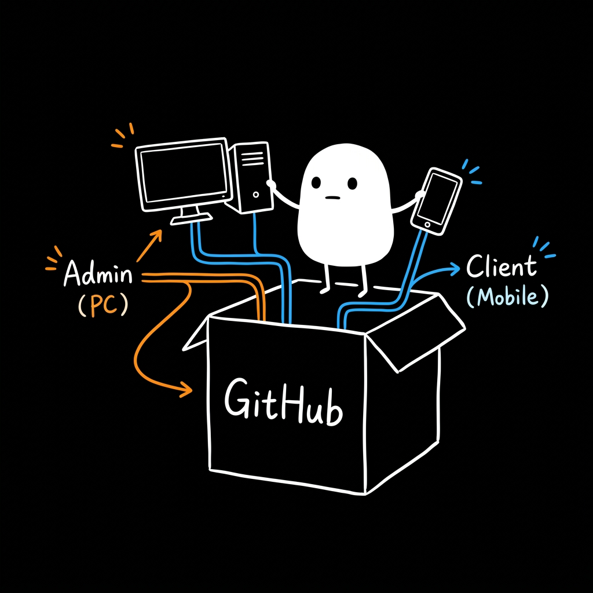
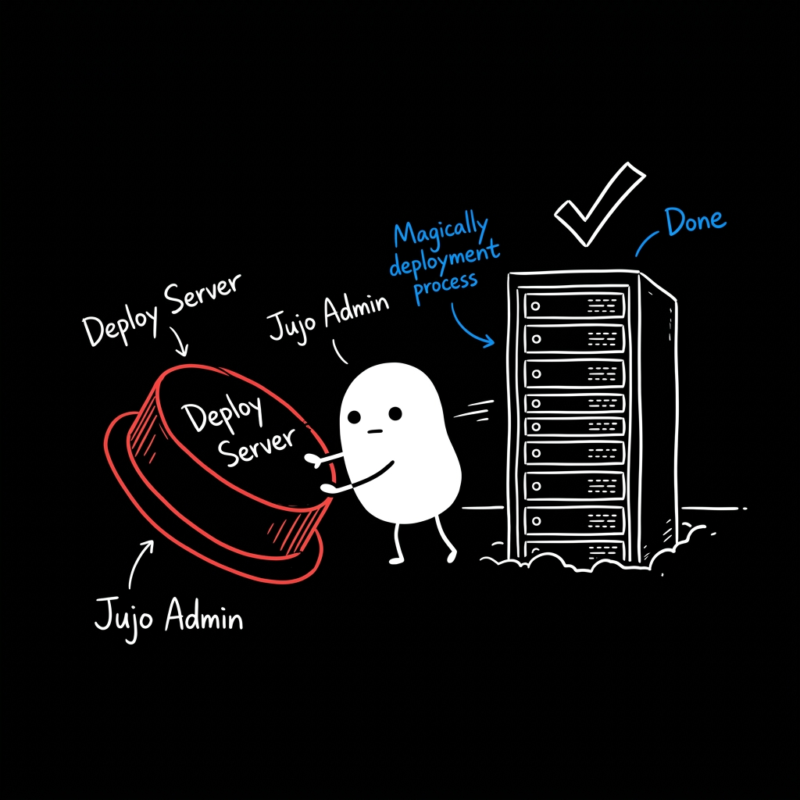
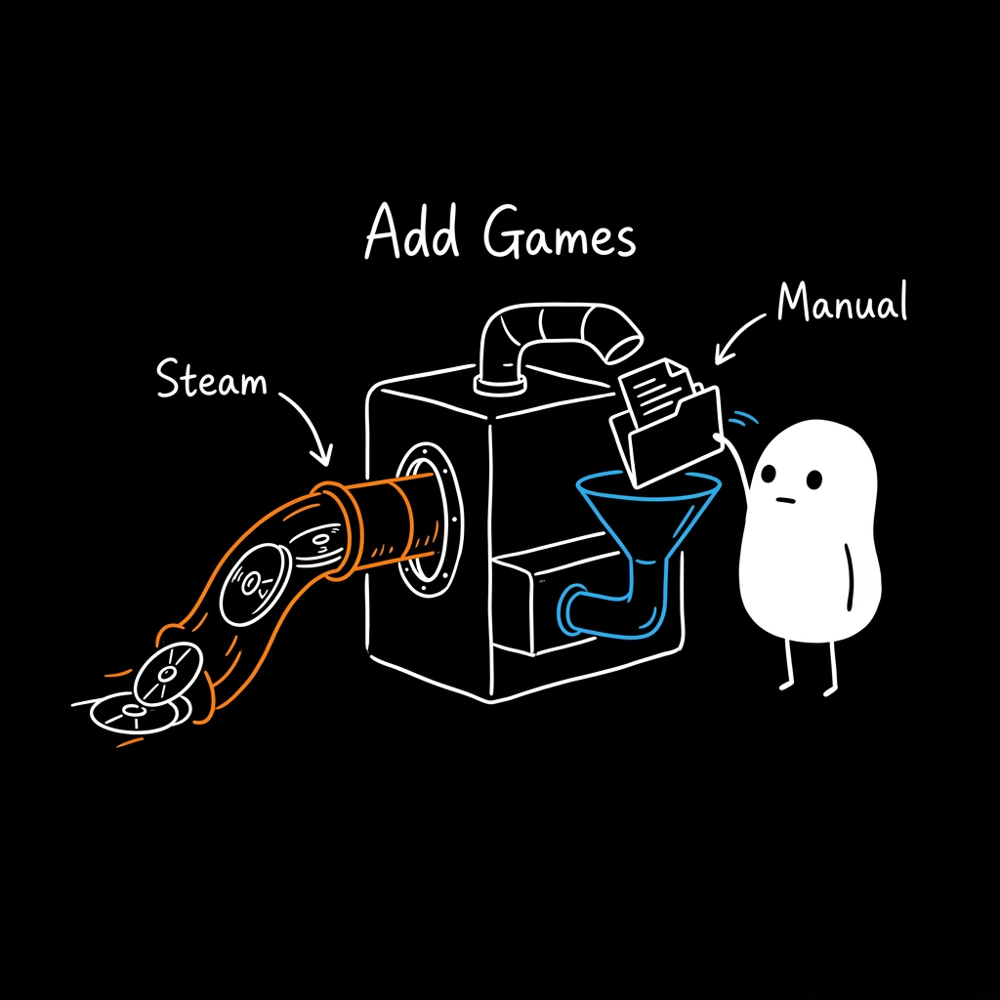
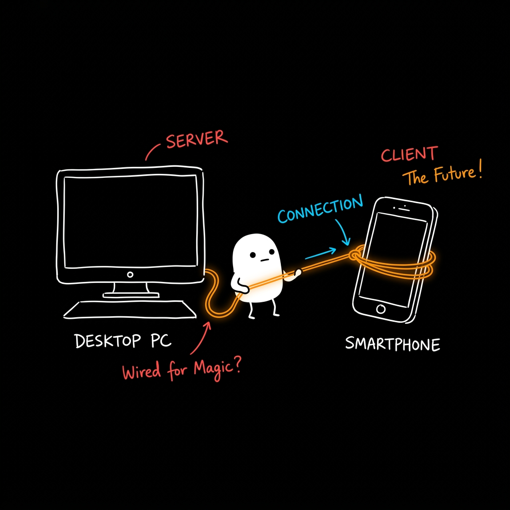

# Jujo Stream

Welcome to Jujo Stream! This is a super simple way to play your PC games right from your phone. 

To get started, you actually don't need to mess with this server code at all. The magic happens completely behind the scenes. You only need two shells to make everything work: **Jujo Admin** (for your PC) and **Jujo Client** (for your phone). They are the only two files you will ever need!

### Getting Started

Setting up your personal cloud gaming experience is quick and easy.

1. **Download the apps**
   Grab the latest releases for your devices:
   * [Download Jujo Admin for PC](https://github.com/vizctas/Jujo.StreamAdmin/releases/latest)
   * [Download Jujo Client for Mobile](https://github.com/vizctas/jujostream/releases/latest)

2. **Deploy the server**
   Open Jujo Admin on your PC. Hit the deploy button and it automatically takes care of the server setup for you. No technical stuff needed.

3. **Add your games**
   Sync your Steam library automatically or drop your games manually.

4. **Connect and play**
   Open the Jujo Client on your phone. It connects to your PC magically, so you can start playing your favorite games right away.

### Step by Step Guide

<table>
  <tr>
    <td></td>
    <td></td>
  </tr>
  <tr>
    <td></td>
    <td></td>
  </tr>
</table>

### Need help?

If you run into any issues, feel free to open an issue. Have fun playing!
